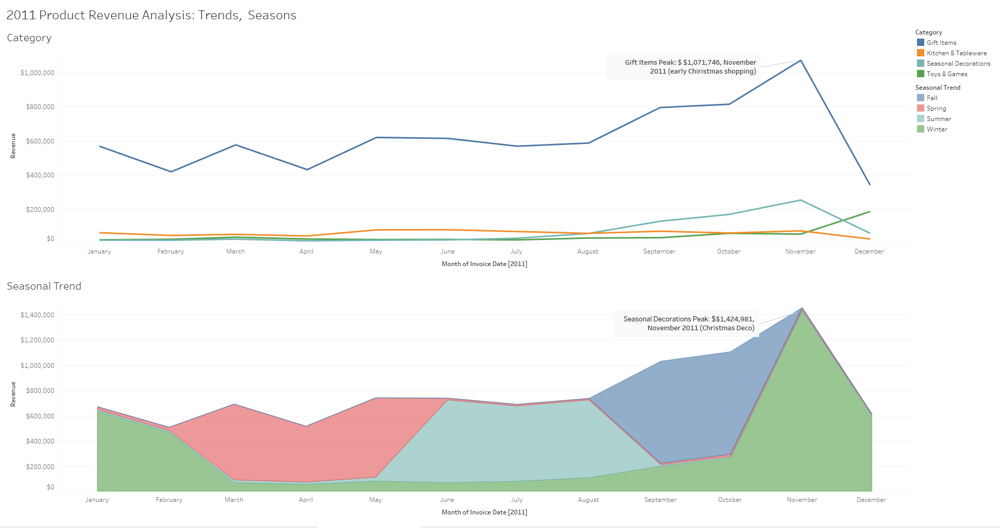
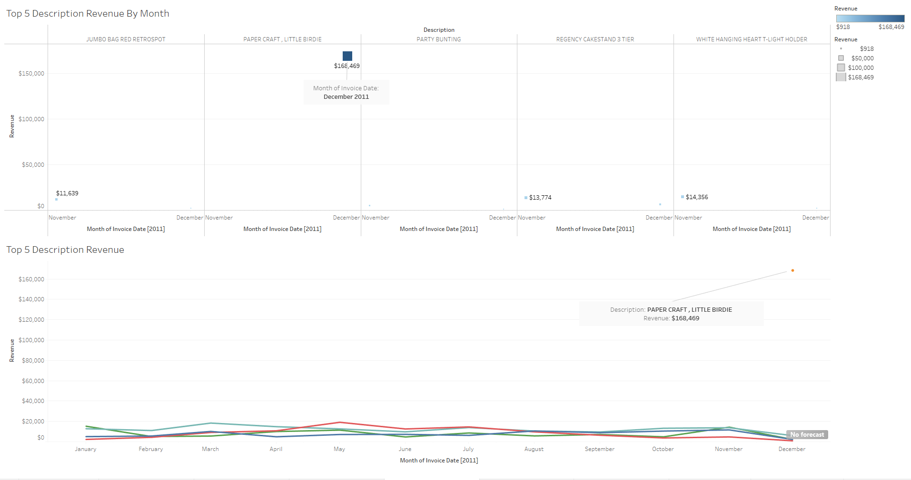
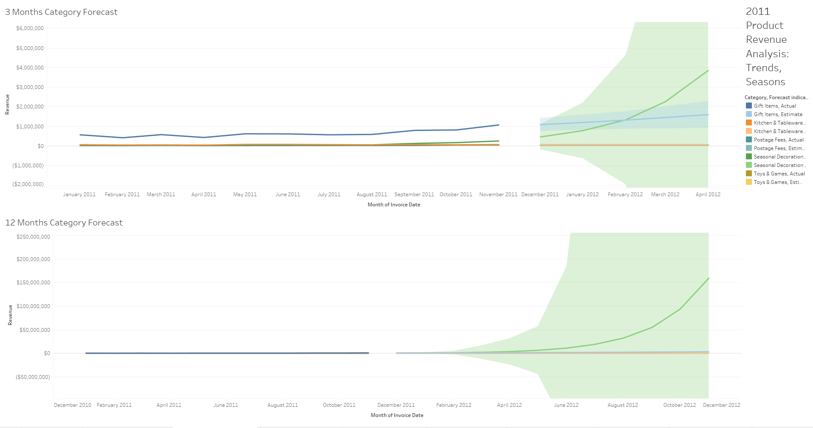
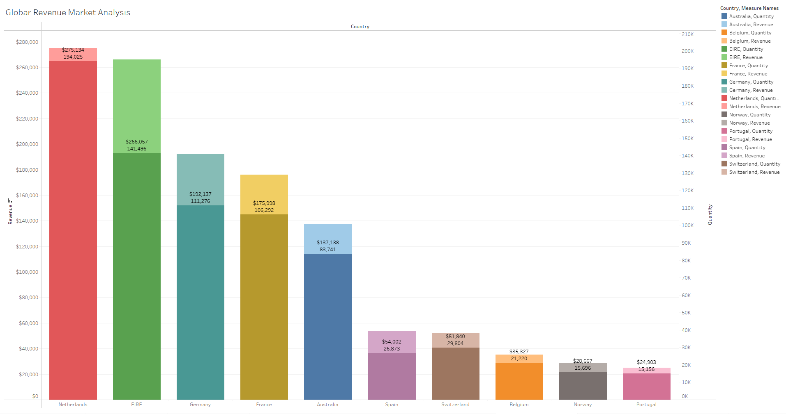
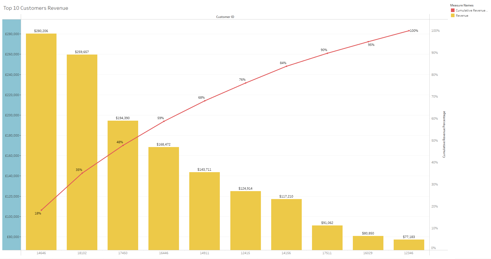
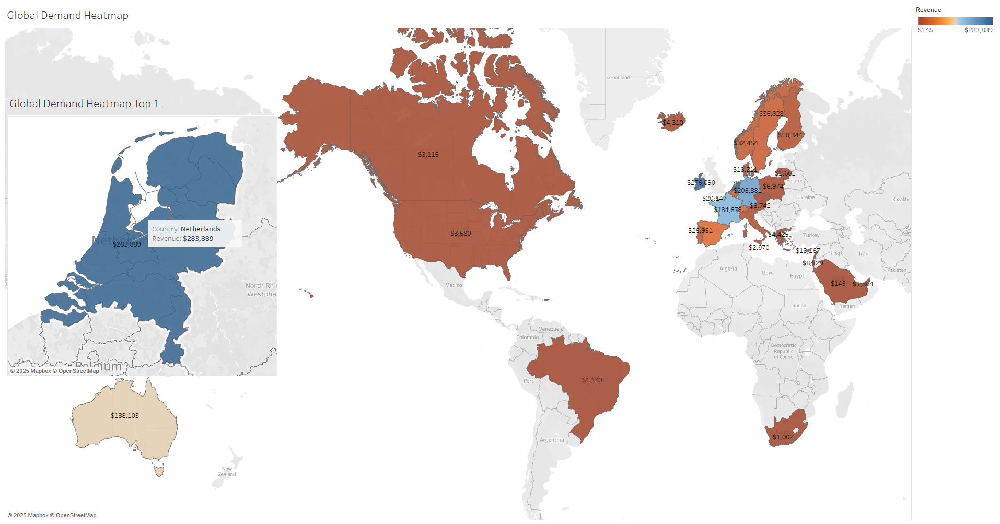

# Retail Analytics Dashboard - Executive Insights

▶️ [Open Interactive Version in Tableau Public (Click Me!!)](https://public.tableau.com/views/Tata-OnlineRetail/Story1)
---

## Overview
This is a job stimulator of Tata Group online retail by Forage. This project provides strategic insights for an online retail business, addressing key questions from the CEO and CMO. The analysis focuses on revenue trends, customer segmentation, and market expansion opportunities while overcoming data challenges including missing customer names and 4,000+ unique product descriptions.

**Key Technical Components**:
- Created product categorization logic using REGEX
- Developed seasonal trend analysis
- Implemented forecasting models
- Designed interactive dashboards for executive decision-making

---

## Q1: Time Series Analysis of Revenue for 2011

### Objective
Analyze monthly revenue trends and seasonal patterns to inform next year's forecasting strategy.

**Approach**:
1. Excluded 2010 data and postage fees
2. Created product categories and seasonal trends using REGEX patterns
3. Implemented 3-month and 12-month forecasting models

**Dashboard 1: Category and Seasonal Trends**

**Category Revenue by Month:**

**Visualization**: Line graph with `MONTH(InvoiceDate)` on columns, `Revenue` on rows, colored by `Category`.
**Insight**: `'Gift Items'` dominated revenue, peaking at $1,071,746 in November due to early Christmas shopping. `'Seasonal Decorations'` followed as the second-highest category.

**Seasonal Trend Revenue by Month:**

**Visualization**: Area chart with `MONTH(InvoiceDate)` on columns, `Revenue` on rows, colored by `Seasonal Trend`.
**Insight**: `'Fall'` and `'Winter'` seasons peaked in November ($1,424,981), driven by seasonal decorations tied to holiday demand.

## Dashboard 2: Top Product Analysis

**Top 5 Descriptions by Revenue (Nov-Dec):**

**Visualization**: Square graph (size and color by Revenue) and line graph, filtered to top 5 descriptions in November and December.
**Insight**: `"Paper Craft, Little Birdie"` led with $168,469 in December, highlighting a standout holiday product.

**Business Insight**: The November spike reflects holiday shopping, with 'Gift Items' and 'Seasonal Decorations' driving revenue. The forecast suggests stocking more seasonal decorations for early 2012.

**Dashboard 3: Revenue Forecasts**

**3-Month Category Forecast:**

**Visualization**: Line graph with a **3-month forecast**, colored by `Category`.
**Insight**: `'Seasonal Decorations'` are projected to overtake `'Gift Items'` by February 2012, indicating a rising trend.

**12-Month Category Forecast:**

**Visualization**: Line graph with a **12-month forecast**, colored by `Category`.
**Insight**: `'Seasonal Decorations'` show sustained growth, while other categories remain stable.

---

## Question 2: Top 10 Countries by Revenue

**Objective**: The CMO wanted to identify the top 10 revenue-generating countries (excluding the UK) and their sales quantities.

**Dashboard 4: Global Revenue Market Analysis**

**Visualization**: Dual-axis bar chart with Country sorted descending on columns, Revenue and Quantity on rows.
**Insight**: The Netherlands topped the list, showing both high revenue and quantity sold, marking it as a key international market.
**Business Insight**: The Netherlands represents a strong opportunity for targeted marketing and inventory allocation outside the UK.

---

## Question 3: Top 10 Customers by Revenue

**Objective**: The CMO sought to visualize the top 10 customers by revenue, from highest to lowest, to prioritize retention efforts.

**Dashboard 5: Top 10 Customers Revenue**

**Visualization**: Dual-axis chart with `Customer ID` sorted descending on columns, Revenue as bars, and cumulative revenue percentage as a line.
**Insight**: The top few customers contribute disproportionately to revenue, with the cumulative percentage reaching 100% quickly, indicating a concentrated revenue base.

**Business Insight**: Focus retention strategies (e.g., loyalty programs, personalized offers) on these high-value customers to maintain revenue stability.

---

## Question 4: Global Demand for Products

**Objective**: The CEO requested a single-view visualization of product demand across all countries (excluding the UK) to inform expansion strategies.

**Dashboard 6: Global Demand Heatmap**

**Global Demand Heatmap:**

**Visualization**: Geographical map with Longitude on columns, Latitude on rows, and Revenue as color intensity.
**Insight**: Darker regions (e.g., the Netherlands) indicate higher demand, visible without scrolling or hovering.

**Zoomed Netherlands View:**
**Visualization**: Focused map highlighting the Netherlands.
**Insight**: Reinforces the Netherlands as a high-demand region, supporting its strategic importance.

**Business Insight**: Prioritize expansion into high-demand regions like the Netherlands to capitalize on existing market interest.

## Key Insights and Recommendations
1. **Revenue Trends**: Holiday-driven peaks in November (Gift Items) and December (Seasonal Decorations) suggest increased inventory planning for Q4.

2. **Market Focus**: The Netherlands stands out as a top non-UK market, ideal for marketing campaigns and potential expansion.
   
3. **Customer Strategy**: A small group of top customers drives significant revenue—target them with tailored retention efforts.

4. **Expansion Planning**: Use the heatmap to identify and prioritize regions with high demand for strategic growth.
